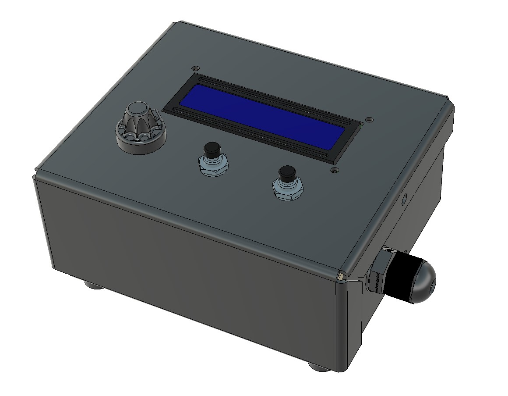
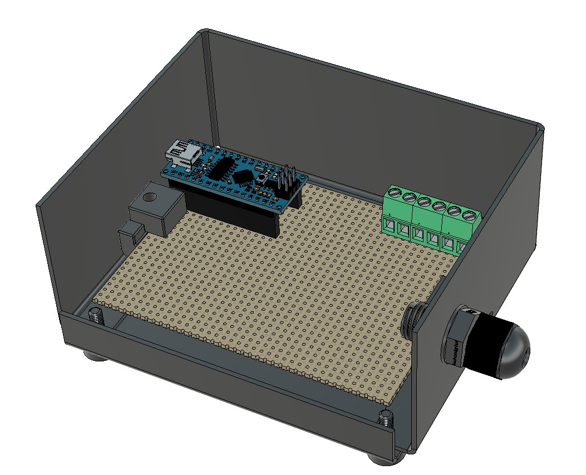
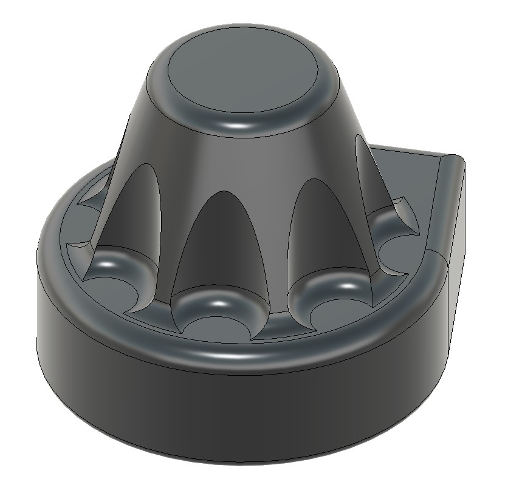

# Handkontroll

[Fusion model](https://a360.co/3voGYaH) 3D model opens in web-browser

### Drawings
PDF files with muliple pages
* [Lid](drawings/lid.pdf)
* [Back](drawings/bottom.pdf)
* [Bottom](drawings/bottom.pdf)

## Knob for potentiometer

[Drawing showing the required 4 feature types](knott_krav.pdf)

## BOM Alixpress parts

* [Buzzers passive](https://www.aliexpress.com/item/4000148640191.html) 
* [Buzzers aktive 5V](https://www.aliexpress.com/item/1005003022264282.html) 
* [Screw connector pluggable terminal block 4 pin](https://www.aliexpress.com/item/4000907549303.html) 
* [JST connectors with female socket, 20cm, 2P, 3P, 4P, 8P](https://www.aliexpress.com/item/32954418743.html) 
* [Panel mount Mini USB socket to male mini USB right angled](https://www.aliexpress.com/item/4000819180471.html) 
* [Arduino NANO 3.0 Old bootloader, CH340 USB driver, soldered pins, with mini USB cable](https://www.aliexpress.com/item/1005002509257579.html) 
* [LED display, yellow blue, 0,98 Inch 128x64](https://www.aliexpress.com/item/32896971385.html) 